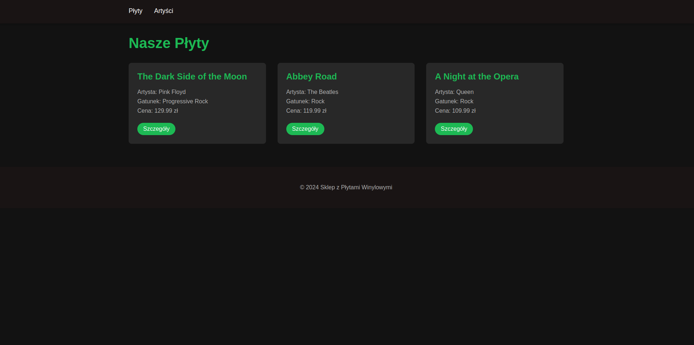
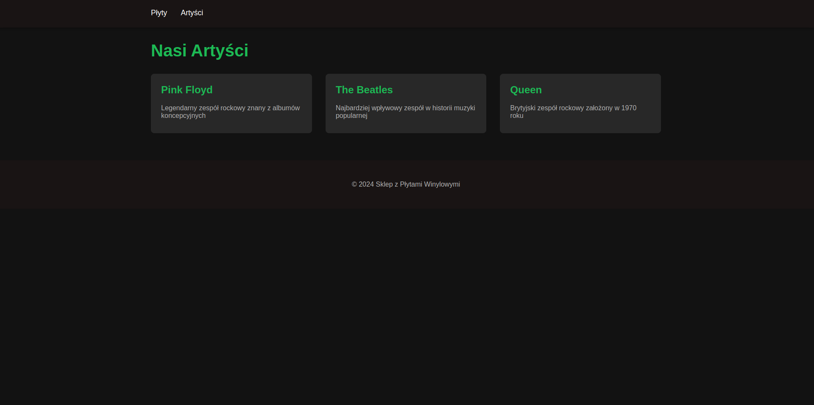

# Sklep z Płytami Winylowymi

Prosty sklep internetowy z płytami winylowymi stworzony w Django.

## Spis treści
- [Funkcjonalności](#funkcjonalności)
- [Wymagania](#wymagania)
- [Instalacja](#instalacja)
- [Struktura projektu](#struktura-projektu)
- [Screenshots](#screenshots)
## Funkcjonalności

- Przeglądanie katalogu płyt winylowych
- Lista artystów
- Szczegóły płyt
- Przeglądanie płyt według gatunków muzycznych
- System ocen płyt
- Ranking najlepiej ocenianych płyt

## Wymagania

- Python 3.11
- Poetry (zarządzanie zależnościami)
- Django 5.0

## Instalacja

1. Sklonuj repozytorium:
bash
```
git clone <repository-url>
cd winyl-shop
```

2. Zainstaluj zależności:
bash
```
poetry install
```
3. Uruchom serwer:
bash
```
poetry run python manage.py runserver
```

4. Utwórz superużytkownika:
bash
```
python manage.py createsuperuser
```

5. Przetestuj aplikację:
bash
```
python manage.py runserver
```


```
winyl-shop/
├── config/ # Konfiguracja projektu
├── vinyl_store/ # Główna aplikacja
│ ├── models.py # Modele danych
│ ├── views.py # Widoki
│ ├── urls.py # URL-e
│ ├── templates/ # Szablony HTML
│ ├── static/ # Pliki CSS
│ └── fixtures/ # Dane początkowe
└── manage.py
```


Screenshots

